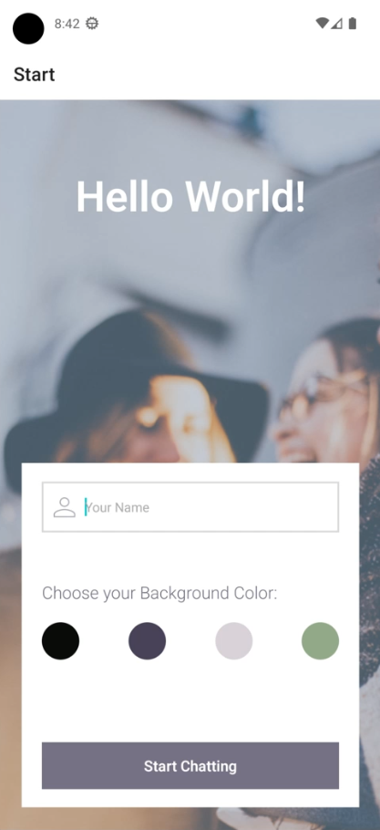
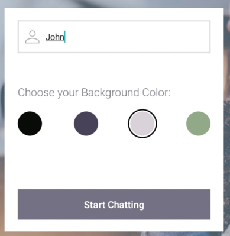
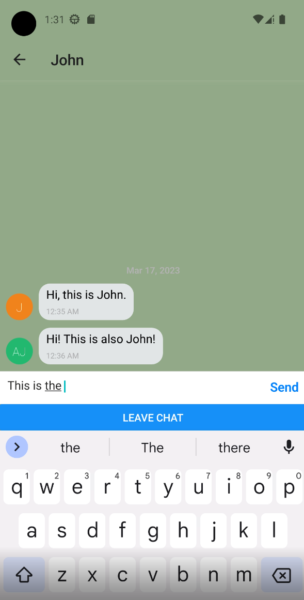
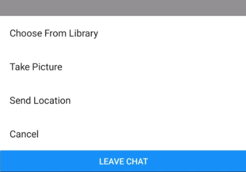
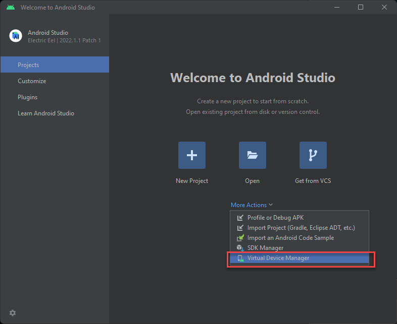

# React Native Chat App: "Hello World!"



This is a simple chat application built using React Native. It allows users to enter a chat room and exchange messages, images and location data with their friends and family. The application stores data both online and offline, allowing users to read their messages even when offline.

## User Stories

The application aims to fulfill the following user stories:

- As a new user, I want to be able to easily enter a chat room so I can quickly start talking to my friends and family.
- As a user, I want to be able to send messages to my friends and family members to exchange the latest news.
- As a user, I want to send images to my friends to show them what I'm currently doing.
- As a user, I want to share my location with my friends to show them where I am.
- As a user, I want to be able to read my messages offline so I can reread conversations at any time.
- As a user with a visual impairment, I want to use a chat app that is compatible with a screen reader so that I can engage with a chat interface.

## Key Features

The application provides the following key features:

- A page where users can enter their name and choose a background color for the chat screen before joining the chat.
- A page displaying the conversation, as well as an input field and submit button.
- The chat must provide users with two additional communication features: sending images and location data.
- Data gets stored online and offline.

## Getting Started

To get started with the application, follow these steps:

1.  Clone the repository to your local machine.
2.  Install the dependencies by running `npm install`.
3.  Start the application by running `npm start`.

## Technical Information

The application is built using React Native and uses the following dependencies:

- react
- react-native
- react-native-gesture-handler
- @react-navigation/native
- @react-navigation/stack

## Components

# App.js

The `App` component is the main component of the React Native chat app. It sets up the navigation and handles the connection to the Firebase database.

## Dependencies

The `App` component requires the following dependencies to be installed:

- `@react-navigation/native`
- `@react-navigation/stack`
- `react-native-gesture-handler`
- `firebase/app`
- `firebase/firestore`
- `firebase/storage`
- `@react-native-community/netinfo`

## Usage

To use the `App` component, import it into your React Native project and include it in your app:

```
import App from './App';

export default function MyChatApp() {
return (
<App />
);
}
```

## Props

The `App` component does not accept any props.

## Components

The `App` component imports and renders two other components:

- `Start`: The start screen where the user enters their name and chooses a background color.
- `Chat`: The chat screen where the user can send and receive messages.

## Firebase Configuration

The `App` component requires a Firebase configuration object with the following properties:

```
const firebaseConfig = {
  apiKey: "<API_KEY>",
  authDomain: "<AUTH_DOMAIN>",
  projectId: "<PROJECT_ID>",
  storageBucket: "<STORAGE_BUCKET>",
  messagingSenderId: "<MESSAGING_SENDER_ID>",
  appId: "<APP_ID>"
};
```

To set up Firebase, you need to create a project in the Firebase Console, enable the Firestore and Storage services, and then copy the configuration object to your app. For more information, see the Firebase documentation.

## Network Status

The `App` component uses the `useNetInfo` hook from `@react-native-community/netinfo` to monitor changes in the network connection status. If the device loses connection, the app disables the Firestore network and displays an alert to the user.

## Stack Navigator

The `App` component uses `createStackNavigator` from `@react-navigation/stack` to set up the navigation between the `Start` and `Chat` screens.

## Firestore and Storage

The `App` component initializes the Firebase app, Firestore database, and Storage instance using the `initializeApp`, `getFirestore`, and `getStorage` functions from `firebase/app`, `firebase/firestore`, and `firebase/storage`, respectively.

## Alert and LogBox

The `App` component uses `Alert` from `react-native` to display an alert when the network connection is lost. It also uses `LogBox` from `react-native` to ignore warning messages related to AsyncStorage and Metro.

# Start.js



The Start component is the landing page of the React Native chat app. It allows the user to enter their name and choose a background color for the chat screen before joining the chat. This component uses Firebase anonymous authentication to create a new user ID for the user.

## User Stories

The Start component aims to fulfill the following user stories:

- As a new user, I want to be able to easily enter my name and choose a background color for the chat screen so that I can start chatting with my friends and family members.

## Key Features

The Start component provides the following key features:

- A page where users can enter their name and choose a background color for the chat screen before joining the chat.
- A button that initiates Firebase anonymous authentication and takes the user to the Chat screen.

## Technical Information

The Start component is built using React Native and uses the following dependencies:

- react
- react-native
- firebase/auth
- react-native-gesture-handler

## Getting Started

To get started with the component, follow these steps:

1.  Clone the repository to your local machine.
2.  Navigate to the `Start` directory.
3.  Install the dependencies by running `npm install`.
4.  Start the application by running `npm start`.

## Usage

To use the component, import it into your React Native project and include it in your navigation stack.

## Props

The component does not accept any props.

## Styling

The component uses a StyleSheet object to define its styles. You can customize the styles by editing this object.

## Dependencies

The component uses the following dependencies:

- react
- react-native
- firebase/auth
- react-native-gesture-handler

Note: Make sure to install these dependencies in your project before using the Start component.

# Chat.js

=========



The Chat component is responsible for displaying the main chat screen of the application where users can send and receive messages. It contains several features such as customized bubbles, the ability to send images and location data, and it supports both online and offline messaging.

### Dependencies

The following modules and components are used in the Chat component:

- React
- React Native
- Firebase Firestore
- Gifted Chat
- AsyncStorage
- CustomActions
- MapView

### Usage

The Chat component can be imported and used in any parent component like any other React component. It requires several props to be passed in when it is called:

- `navigation`: This is a prop that is passed in automatically by the React Navigation library. It is used for navigating to and from different screens in the application.

- `route`: This is also a prop that is passed in automatically by the React Navigation library. It contains information about the current route that the user is on, including the name, color, and user ID.

- `db`: This is a reference to the Firebase Firestore database. It is used to interact with the messages collection and add new messages to the collection.

- `isConnected`: This is a boolean value that is passed in to indicate whether the user is connected to the internet or not. If the user is offline, messages will be stored locally until the user is connected again.

- `storage`: This is a reference to the Firebase Storage service. It is used to upload and download images that are sent through the chat.

### Customizations

The Chat component can be customized in several ways:

- Customized bubbles: The appearance of chat bubbles can be customized using the `renderBubble` function.

- Custom input toolbar: The input toolbar can be conditionally rendered based on the user's connection status using the `renderInputToolbar` function.

- Custom actions: Custom actions such as sending images and location data can be added using the `renderCustomActions` function.

- Custom view for displaying locations: The `renderCustomView` function can be used to create a custom view for displaying location data.

### Example Usage

```
import React from 'react';
import { View } from 'react-native';
import firebase from 'firebase';
import Chat from './Chat';

// Initialize Firebase app
firebase.initializeApp({
// your firebase config goes here
});

const App = () => {
const db = firebase.firestore();
const storage = firebase.storage();

return (
<View style={{ flex: 1 }}>
<Chat db={db} storage={storage} />
</View>
);
};

export default App;
```

Note: In the above example, the `isConnected` prop is not passed in explicitly, so it defaults to `true`. If the user is offline, messages will be stored locally until the user is connected again.

# CustomActions.js



`CustomActions.js` is a component that allows users to perform different actions within the chat interface, such as uploading an image, taking a photo, or sharing their current location.

Usage:

To use the `CustomActions` component, import it into your React Native project and include it in your chat interface.

```
import CustomActions from './CustomActions';

<CustomActions
wrapperStyle={{}}
iconTextStyle={{}}
storage={firebase.storage()}
onSend={(message) => handleSend(message)}
userID={currentUser.uid}
/>
```

Props:

The `CustomActions` component accepts the following props:

- `wrapperStyle` (optional): Custom styles to be applied to the container of the action button.
- `iconTextStyle` (optional): Custom styles to be applied to the text of the action button.
- `storage` (required): An instance of Firebase storage.
- `onSend` (required): A callback function to be executed when the user sends a message.
- `userID` (required): The ID of the current user.

Methods:

The `CustomActions` component has the following methods:

- `pickImage()`: Allows users to select an image from their device's media library.
- `takePhoto()`: Allows users to take a photo with their device's camera.
- `getLocation()`: Retrieves the user's current location and sends it as a message.
- `uploadAndSendImage(imageURI)`: Uploads an image to Firebase storage and sends it as a message.

Dependencies:

The `CustomActions` component has the following dependencies:

- `@expo/react-native-action-sheet`: A library that provides a cross-platform `ActionSheet` component for React Native.
- `expo-image-picker`: A library that provides an interface for accessing the device's media library and camera.
- `expo-location`: A library that provides an interface for accessing the device's current location.
- `firebase/storage`: Firebase storage module for storing and retrieving files.

Note: Make sure to install these dependencies in your project before using the `CustomActions` component.

# Testing the App

Below is a basic guide on setting up Expo and Android Studio to test the app:

1.  Install Node.js on your machine by downloading the installer from the official website and following the installation instructions.

2.  Install Expo CLI by opening a terminal or command prompt window and typing the following command:

`npm install -g expo-cli`

1.  Install Android Studio by downloading it from the official website and following the installation instructions. This will install the Android SDK and necessary dependencies.

2.  Open Android Studio and navigate to the SDK Manager. Under the "SDK Platforms" tab, make sure that the latest version of Android (currently Android 12) is installed. Under the "SDK Tools" tab, make sure that the following items are installed:

- Android SDK Build-Tools
- Android Emulator
- Android SDK Platform-Tools
- Android SDK Tools

1.  Configure the Android emulator by opening the AVD Manager in Android Studio. Create a new virtual device with the desired specifications (e.g. Pixel 4, API Level 31).



2.  Clone or download the app source code from the GitHub repository.

3.  Open a terminal or command prompt window and navigate to the app directory.

4.  Install the required dependencies by typing the following command:

`npm install`

1.  Start the Expo development server by typing the following command:

`expo start`

1.  Once the development server is running, you can use your Android emulator to test the app. Open the emulator and wait for it to fully load. Then, in the Expo development server window, click "Run on Android device/emulator" and follow the instructions to install and launch the app on the emulator.

That's it! You should now be able to test the app on your Android emulator using Expo. If you encounter any issues or errors, refer to the official Expo and Android Studio documentation for troubleshooting help.

## Credits

This application was created by John Dussold as part of the CareerFoundry JavaScript FullStack curriculum.
